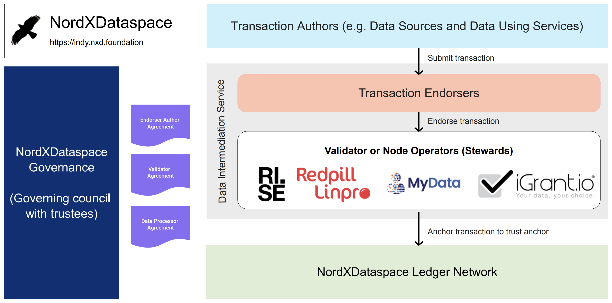

# User manual for node operators or stewards

*This is a user manual towards administrators of NordXDataSpace node operators or stewards to manage and operate Indy ledger networks*.

# Table of contents

- [User manual for node operators or stewards](#user-manual-for-node-operators-or-stewards)
- [Table of contents](#table-of-contents)
- [1.0 Prerequisites](#10-prerequisites)
  - [1.1	Reference deployment](#11reference-deployment)
  - [1.2	Node requirements](#12node-requirements)
  - [2.0 Add node to the existing pool](#20-add-node-to-the-existing-pool)
  - [2.1 Setup the node environment and configuration](#21-setup-the-node-environment-and-configuration)
  - [2.2 Obtain BLS, BLS proof of possession, client and node public keys](#22-obtain-bls-bls-proof-of-possession-client-and-node-public-keys)
  - [2.3 Create the steward DID](#23-create-the-steward-did)
  - [2.4 Register the steward DID](#24-register-the-steward-did)
  - [2.5 Register the new node to the pool ledger](#25-register-the-new-node-to-the-pool-ledger)
  - [2.6 Run the node](#26-run-the-node)
  - [2.7 Update organisation details](#27-update-organisation-details)
- [3.0 Pool upgrade guideline](#30-pool-upgrade-guideline)
  - [3.1 Pool Upgrade Transaction](#31-pool-upgrade-transaction)
  - [3.2 Node Upgrade Transaction](#32-node-upgrade-transaction)
- [4.0 Indy CLI](#40-indy-cli)
- [5.0 Troubleshooting](#50-troubleshooting)
  - [Remove a Node from a Pool](#remove-a-node-from-a-pool)
- [References](#references)

# 1.0 Prerequisites

## 1.1	Reference deployment 

The proposed initial reference deployment of the NordXDataSpace Indy network is as shown below ([Original moqup](https://app.moqups.com/U33NTlc3ixcLlis38rZvb82Jmvym70HF/view/page/aba8d84a2)):



## 1.2	Node requirements

* Ubuntu 16.04+
* 1 CPU
* 4GB Memory
* 30GB+ Storage
* Ports 9701 and 9702 exposed
* Static IP address
* Docker
* Docker Compose (v1)

## 2.0 Add node to the existing pool

## 2.1 Setup the node environment and configuration

Clone the repository.

```bash
git clone https://github.com/decentralised-dataexchange/nordxdataspace.git
```

Change directory to indy-node.

```bash
cd indy-node
```

Build docker images

```bash
make all
```

Change directory to docker-compose.

```bash
cd docker-compose
```

Generate random 32 byte seed and store .node.env file. Keep a copy stored in secure location.

```
./scripts/generate_random_seeds.sh
```

Update the node name in .env file. Replace `NewNodeName` with the appropriate node name. Node name should be of the format <ORG_NAME_IN_CAPITALS>Node<NUMBER> for e.g for Google, it can be GoogleNode6. Do consult with iGrant.io trustee in regards to the same.

```
sed -i 's/INDY_NODE_NAME=REDPILLLINPRONode5/INDY_NODE_NAME=NewNodeName/g' .env
```

## 2.2 Obtain BLS, BLS proof of possession, client and node public keys

Run `docker-compose up --scale indy-controller=0`. You will find the similar information as the following at the start of the logs:

```
...
indy_node          | Public key is ...
indy_node          | Verification key is ...
indy_node          | BLS Public key is ...
indy_node          | Proof of possession for BLS key is ...
indy_node          | [OK]	 Init complete
...
```

Stop the container(`CTRL-C`). Copy the above public information and as these information are required to register the node to the pool ledger in Chapter 2.5.

Move the `pool_transactions_genesis` and `domain_transactions_genesis` from `data/sandbox` folder to `data/lib_indy/sandbox` folder.

```
sudo cp data/sandbox/pool_transactions_genesis data/lib_indy/sandbox
```

```
sudo cp data/sandbox/domain_transactions_genesis data/lib_indy/sandbox
```

## 2.3 Create the steward DID

Node operator is required to create a DID. This can happen independent of server running the node, i.e. can be executed in an external machine with `indy-cli` (Refer [Chapter 4.0](#40-indy-cli) to execute using docker) installed. 

Note: Additionally node operator can share the seed from earlier step to the trustee who can then perform steps in Chapter 2.4 and Chapter 2.5. This approach is not recommended for production environments as node operator DID is exposed to the trustee.

Start indy-cli.

```bash
indy-cli
```

Create a wallet for node operator.

```bash
indy> wallet create nodeoperatorwallet key=nodeoperatorwalletkey
Wallet "nodeoperatorwallet" has been created
```

Open the wallet.

```bash
indy> wallet open nodeoperatorwallet key=nodeoperatorwalletkey
Wallet "nodeoperatorwallet" has been opened
```

Create a did for node operator. Replace `<SEED>` with seed from previous step.

```bash
nodeoperatorwallet:indy> did new seed=<SEED> metadata=steward
Did "UWZuggH9xHcB9RVzArrPXM" has been created with "~4fZGAtr5wEbtVqaL19vvQo" verkey
Metadata has been saved for DID "UWZuggH9xHcB9RVzArrPXM"
```

## 2.4 Register the steward DID

Steward DID created in the previous chapter must be registered to the ledger. Provide iGrant.io trustee with steward DID and verkey. You will be notified through email or other out-of-band communication methods that the DID is registered to the ledger.

## 2.5 Register the new node to the pool ledger

Start `indy-cli` and open wallet created in the previous step. Execute the following:

```bash
indy> pool create nordxdataspace gen_txn_file=pool_transactions_genesis
```

```bash
indy> pool connect nordxdataspace
```

```bash
indy> did use <STEWARD_DID>
```

Replace the values with information from previous steps.

```bash
indy> ledger node target=<VERIFICATION_KEY> alias=<NODE_ALIAS> node_ip=<PUBLIC_IP_ADDRESS> node_port=9701 client_port=9702 client_ip=<PUBLIC_IP_ADDRESS> services=VALIDATOR blskey=<BLS_PUBLIC_KEY> blskey_pop=<BLS_PROOF_OF_POSSESSION_KEY> send=true
```

Note: Make sure the information is accurate.

## 2.6 Run the node

```bash
docker-compose up -d
```

Check the logs to ensure the node is running.

```bash
docker logs -f indy_node
```

## 2.7 Update organisation details

Fork the repository and raise a PR against the main branch after updating the node operator details at below location.

https://github.com/decentralised-dataexchange/nordxdataspace/blob/main/node-operators/list.json


# 3.0 Pool upgrade guideline

The whole pool (that is each node in the pool) can be upgraded automatically without any manual actions via `POOL_UPGRADE` transaction.

As a result of upgrade, each Node will be at the specified version, that is, a new package, for example, deb package, will be installed.

Migration scripts can also be performed during the upgrade to deal with breaking changes between the versions.

## 3.1 Pool Upgrade Transaction

* Pool Upgrade is done via the `POOL_UPGRADE` transaction.
* The txn defines a schedule of upgrade (upgrade time) for each node in the pool.
* Only the `TRUSTEE` can send `POOL_UPGRADE`.
* This is a common transaction (written to config ledger), so the consensus is required.
* There are two main modes for `POOL_UPGRADE`: forced and non-forced (default).
    * Non-forced mode schedules upgrade only after `POOL_UPGRADE` transaction is written to the ledger; that is there was a consensus. Forced upgrade schedules upgrade for each node regardless of whether `POOL_UPGRADE` transaction is actually written to the ledger, that is it can be scheduled even if the pool lost consensus.
    * Non-forced mode requires that upgrade of each node is done sequentially and not at the same time (so that a pool is still working and can reach consensus during the upgrade). On the other hand, the forced upgrade allows the upgrade of the whole pool at the same time.
* One should usually use non-forced Upgrades assuming that all changes are backward-compatible.
* If there are non-backward-compatible (breaking) changes, then one needs to use forced Upgrade and make it happen at the same time on all nodes (see below).

## 3.2 Node Upgrade Transaction
* Each node sends `NODE_UPGRADE` transaction twice:
    * `in_progress` action: just before start of the Upgrade (that is re-starting the node and applying a new package) to log that Upgrade started on the node.
    * `success` or `fail` action: after upgrading the node to log the upgrade result.
* `NODE_UPGRADE` transaction is a common transaction (written to config ledger), so consensus is required.

# 4.0 Indy CLI

> Note: Remember to execute `make-all` command to build the image.

Prepare the local folder for storing `indy-cli` data by executing the following commands:

```
sudo chown -R 1000:root data/indy_client
```

```
chmod -R ug+rw data/indy_client
```

Execute the following command from `docker-compose` folder to run `indy-cli`.

```
docker run -v ./data/indy_client:/home/indy/.indy_client -v ./data/sandbox/pool_transactions_genesis:/home/indy/pool_transactions_genesis --rm -it nordxdataspace/indy_cli indy-cli
```

# 5.0 Troubleshooting

## Remove a Node from a Pool

`indy-cli` command:
- `ledger node target=<node id> alias=<nodes alias> services=`
  - Where:
    - `<node id>` is value of the `dest` attribute in the output of `read_ledger`;
    - `<nodes alias>` is the name of the node.

# References

1. Hyperledger Indy documentation: https://hyperledger-indy.readthedocs.io/en/latest/ 